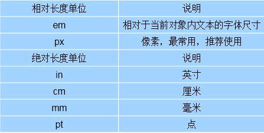
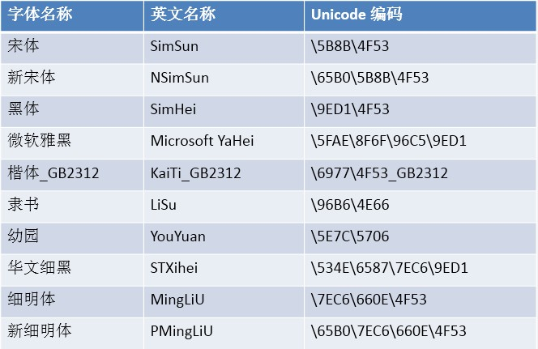
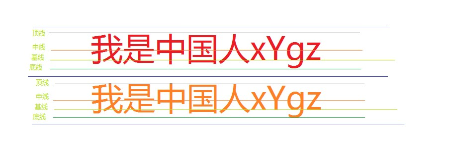

## CSS文本属性/文本外观属性/背景属性

[TOC]

## CSS文本属性

###  1.font-size属性（大小）

－	font-size属性用于设置**字号**，该属性的值可以使用相对长度单位，也可以使用绝对长度单位。其中，相对长度单位比较常用，推荐使用像素**单位px**，绝对长度单位使用较少。



```html
<!--
1em = 当前的字体大小(可以是继承过来的)
font-size: 2em;

css3新特性: 新单位 rem
需要设置根节点的字体,相当于参考字体
html {
	font-size:16px;
}

p {
	font-size:1.5rem; //相当于24px
}
-->
```

###  2.font-family属性（字体）

－	font-family属性用于设置字体。网页中常用的字体有宋体、微软雅黑、黑体等，例如将网页中所有段落文本的字体设置为微软雅黑，可以使用如下CSS样式代码：

```HTML
p {
	font-family: “宋体”,“微软雅黑”;
}
```

- 可以同时指定多个字体，中间以逗号隔开，表示如果浏览器不支持第一个字体，则会尝试下一个，直到找到合适的字体。

**注意以下几点**

- 各种字体之间必须使用英文状态下的逗号隔开。
- 中文字体需要加英文状态下的引号，英文字体一般不需要加引号。当需要设置英文字体时，英文字体名必须位于中文字体名之前。
- 如果字体名中包含空格、#、$等符号，则该字体必须加英文状态下的单引号或双引号，例如font-family: “Times New Roman”;。
- 尽量使用系统默认字体，保证在任何用户的浏览器中都能正确显示。
- 使用unicode对中文字体进行编码。



###  3.font-weight属性（加粗）

－	font-weight属性用于定义字体的粗细，其可用属性值：

- normal
- bold
- **bolder**　加粗
- lighter
- 100~900（100的整数倍）。

###  4.font-style属性（斜体）

font-style属性用于定义字体风格，如设置斜体、倾斜或正常字体，其可用属性值如下：

- normal：默认值，浏览器会显示标准的字体样式。
- **italic：浏览器会显示斜体的字体样式。**
- oblique：浏览器会显示倾斜的字体样式。

###  5.font综合设置

－	font属性用于对字体样式进行综合设置，其基本语法格式如下：

```html
/*必须保留font-size和font-family属性，否则font属性将不起作用。*/
/*font: bolder italic 40px "宋体";*/
  font: 40px "宋体";
```


[TOC]

---


## 文本外观属性

###  1.文本颜色 color

－	**表示方法多样**

- 英文单词表示; red/green;yellow;blue;
- 16进制表示法　#000000
- RGB三色法　R:0~255   G:0~255   B:0~255（可以是0~255 的数字，也可以是百分比）
- 色调，饱和度，亮度

###  2.字间距 letter-spacing

－	letter-spacing属性用于定义字间距，所谓字间距就是**字符与字符**之间的空白。其属性值可为不同单位的数值，**允许使用负值**，默认为normal。

###  3.单词间距 word-spacing

- word-spacing属性用于定义英文单词之间的间距，对中文字符无效。和letter-spacing一样，其属性值可为不同单位的数值，允许使用负值，默认为normal。
- word-spacing和letter-spacing均可对英文进行设置。不同的是letter-spacing定义的为字母之间的间距，而word-spacing定义的为英文单词之间的间距。

###  4.行间距(行高) line-height

－	line-height属性用于设置行间距，就是行与行之间的距离，即字符的垂直间距，一般称为行高。line-height常用的属性值单位有三种，分别为**像素px**，**相对值em**和**百分比%**，实际工作中使用最多的是像素px。



**行高是指两条基线之间的距离**

```html
/*line-height: 120%;*/
/*line-height: 36px;*/
/*line-height: 1.2em;*/
/*
      three的行高为 36px
      以上3种方式设置的line-height都会让后代继承：继承祖先元素的行高！
*/
<!--
      后代会继承该因子而不是继承父元素行高！！！！
-->                        
      line-height: 1.2;   !!!!!!!!!!!!
```

###  5.文本修饰（三条线）text-decoration

- none：没有装饰（正常文本默认值）。
- underline：下划线。
- overline：上划线。
- **line-through**：删除线。

```html
<!--text-decoration后可以赋多个值，用于给文本添加多种显示效果-->

text-decoration: underline overline line-through;
```

###  6.水平对齐方式 text-align

－	text-align属性用于设置文本内容的水平对齐，相当于html中的align对齐属性。其可用属性值如下：

- left：左对齐（默认值）
- right：右对齐
- center：居中对齐

###  7.垂直对齐方式 vertical-align(适用于行内元素)

－	vertical-align 常用属性值：

- baseline： 将支持valign特性的对象的内容与基线对齐
- sub： 垂直对齐文本的下标
- super： 垂直对齐文本的上标
- top： 将支持valign特性的对象的内容与对象顶端对齐
- text-top： 将支持valign特性的对象的文本与对象顶端对齐
- middle： 将支持valign特性的对象的内容与对象中部对齐
- **bottom： 将支持valign特性的对象的文本与对象底端对齐**
- text-bottom： 将支持valign特性的对象的文本与对象顶端对齐

###  8.首行缩进 text-indent

－	text-indent属性用于设置首行文本的缩进，其属性值可为不同单位的数值、**em字符**宽度的倍数、或相对于浏览器窗口宽度的百分比%，允许使用负值, 建议使用em作为设置单位。

```html
text-indent:2em;	<!--首行缩进２字符-->
```

### 9.去掉项目符号 line-style

- line-style : none; 

### 10.文本在垂直方向居中 line-height

- height : (xxx) px ;
- line-height : (height) ;


### 11.大小写转换 text-transform

- uppercase 转换为大写
- lowercase 转换为小写
- capitalize 首字母大写


###  自学属性

－	**空白符处理 white-space**

使用HTML制作网页时，不论源代码中有多少空格，在浏览器中只会显示一个字符的空白。在CSS中，使用white-space属性可设置空白符的处理方式，其属性值如下：

- normal：常规（默认值），文本中的空格、空行无效，满行（到达区域边界）后自动换行。
- pre：预格式化，按文档的书写格式保留空格、空行原样显示。
- nowrap：空格空行无效，强制文本不能换行，除非遇到换行标记。内容超出元素的边界也不换行，若超出浏览器页面则会自动增加滚动条。

－　**自动换行 word-break**

- normal 使用浏览器默认的换行规则。
- break-all 允许在单词内换行。
- keep-all 只能在半角空格或连字符处换行。

－　**word-wrap**

属性允许长单词或 URL 地址换行到下一行normal

- normal 只在允许的断字点换行（浏览器保持默认处理）。
- break-word 在长单词或 URL 地址内部进行换行,几乎得到了浏览器的支持。

**背景样式是使用CSS对标签元素进行样式设置**

[TOC]

---

## 背景具体属性 

### 1.背景颜色   background-color

－	三种方式表示

- background-color : red ;
- background-color : #F00 ;
- background-color : RGB(255,0,0) ;

### 2.背景图片　background-image

- background-image  url("图片相对路径");

### 3.背景平铺　background-repeat

- no-repeat : 不平铺
- repeat : 默认平铺
- repeat - x : 沿Ｘ轴平铺
- repeat - y : 沿Ｙ轴平铺

### 4.背景位置　background-position

－	两种方式表示

- background-position : top center ;
- background-position : 100px  100px ;

### 5.背景固定　background-attachement

- background-attachement : fixed ;	fixed 表示固定
- 应用场景:背景比较大,视窗口比较小,视窗口的滚动可以看见图片

### 6.背景大小 background-size

#### background-size 设置背景图片的尺寸

属性值有:

- **cover**会自动调整缩放比例，背景大小 >  元素大小，如有溢出部分则会被隐藏。
- **contain**会自动调整缩放比例，元素大小  >  背景大小  。
- 也可以使用**长度单位或百分比** 

```html
<!--
contain: 背景图片 小于等于 元素
  cover: 背景图片 大于等于 元素
-->

<!--
background-size: cover;
background-size: 520px 320px;
/*width, height*/
-->

/*一步到位，和元素宽高一致*/
background-size: 100% 100%;
```

### 7.综合表示

-　background: red 　url("./images/zhaosi.jpg") 　no-repeat 　10px 　20px　fixed ;


## 补充内容

### cursor 设置光标类型(pointer)小手

- **设置或检索在对象上移动的鼠标指针采用何种系统预定义的光标形状。**
- cursor: pointer;  **鼠标为小手样式**


### opacity 设置透明度

- 值为０，不显示。
- 不适合的情况：只想使背景透明，文本无影响。


