## CSS 3  部分新特性(阴影/盒子/背景/渐变/过渡/2D转换/3D转换)/CSS 3 动画/CSS 3伸缩布局/媒体查询

[TOC]

### 1.CSS 3简介

- CSS3是层叠样式表(Cascading Style Sheets) 语言的最新进展，目的在于扩展 CSS2.1。 
  它为我们带来了许多期待已久的新特性， 例如圆角，阴影，gradients(渐变)，transitions(过渡) 或 
  animations(动画) ， 当然还有新的布局如 multi-columns ， flexible box 或 grid layouts。 
  这些实验性的内容带有 vendor-prefixed(提供商前缀)， 并且尽量不要在生产环境中使用， 即便要用， 也要时刻谨记： 
- 这些内容的语法和语义在未来很有可能会改变。
- CSS3是CSS2的进化版，新增了许多特性，是的web开发更加快捷和高效。

### 2.CSS 3应用原则

- 渐进增强，优雅降级
- 遵照产品的方案
- 考虑用户群体

### 3.CSS 3参考手册

```html
[]:表示可以选择填写的项  
||: 表示或者  
|： 表示选择其中一个  
* : 表示 任意个  
{}: 表示范围  
```

### 4.CSS 3 选择器

- 关系选择器
  1.包含选择符(E F)
  2.子选择符(E>F)
  3.相邻选择符(E+F)
  4.兄弟选择符(E~F)
- 属性选择器
  1.E[att]
  2.E[att=“val”]
  3.E[att~=“val”]
  4.E[att^=“val”]
  5.E[att$=“val”]
  6.E[att*=“val”]
  7.E[att|=“val”] 
- 伪类选择器
  常用：
  E:link
  E:visited
  E:hover
  E:active
  E:focus
  E:first-child
  E:last-child
  E:nth-child
- 伪元素
  1.E:first-letter/E::first-letter
  2.E:first-line/E::first-line
  3.E:before/E::before
  4.E:after/E::after 

### 5.CSS 3颜色

#### 不透明度 opacity

- 使用浮点数指定对象的不透明度。值被约束在[0.0-1.0]范围内，如果超过了这个范围，其计算结果将截取到与之最相近的值。
- 比如：`opacity: 0.6;`
- opacity: 影响是**所有后代的透明度**

#### RGB/RGBA:

- Red、Green、Blue、Alpha 即RGBA   	RGBA(255,0,0,0.5)
- R、G、B 取值范围0~255 
- RGBA:的透明度影响的只是自己

#### hsla:

Hue、Saturation、Lightness、Alpha即HSLA
H 色调: 取值范围0~360，0/360表示红色、120表示绿色、240表示蓝色
S 饱和度: 取值范围0%~100%
L 亮度: 取值范围0%~100%
A 透明度: 取值范围0~1 

### 6.CSS 3文本

#### 文本阴影(text-shadow)

- 可分别设置偏移量、模糊度、颜色（可设透明度）。

1.水平偏移量 正值向右 负值向左。
2.垂直偏移量 正值向下 负值向上。
3.模糊度是不能为负值。
4.使用逗号分割可以设置多重效果。
比如：
`text-shadow: -5px -5px 2px red, 10px 10px 2px green;`

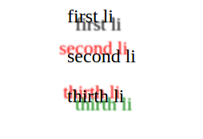

```html
text-shadow: -1px -1px 1px #000, 1px 1px 1px #FFF;
```

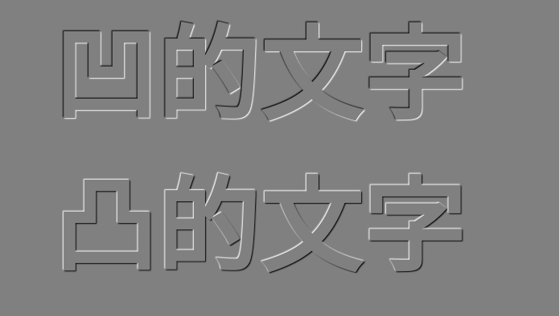

#### CSS 3边框圆角化(border-radius)

- 边框圆角、边框阴影属性，应用十分广泛，兼容性也相对较好，具有符合渐进增强原则的特征，我们需要重点掌握。 
- border-radius: 设置边框圆角
- border-radius: 宽度|百分比 / 宽度|百分比
- 可分别设置长、短半径，以“/”进行分隔，遵循“1，2，3，4”规则，“/”前面的1~4个用来设置横轴半径（分别对应横轴1、2、3、4位置 ），“/”后面1~4个参数用来设置纵轴半径（分别对应纵轴1、2、3、4位置 ）设置顺序： 1,2,3,4
- 比如：
  - border-radius: 10px ;
  - border-radius: 10px 11px;
  - border-radius: 10px/11px ; 
- border-top-left-radius: 50px 30px;设置左上角的圆角

#### CSS 阴影 (box-shadow)

- 水平偏移量 正值向右负值向左。
- 垂直偏移量 正值向下负值向上。
- 模糊度是不能为负值。
- inset可以设置内阴影。
- 设置边框阴影不会改变盒子的大小，即不会影响其兄弟元素的布局。
  可以设置多重边框阴影，实现更好的效果，增强立体感。
  比如：
  `box-shadow: 2px 2px 8px gray;`
- 外延`box-shadow: 2px 2px 8px 5px gray;`
- 内延`box-shadow: 2px 2px 8px 5px gray inset;`

#### 边框图片 (border-image) 

- 设置的图片将会被“切割”成九宫格形式，然后进行设置,如下图:

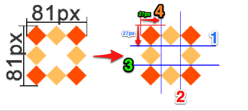

- 其中四个角位置、形状保持不变，中心位置水平垂直两个方向平铺,形成如下效果：

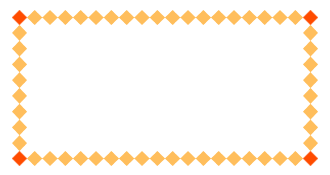

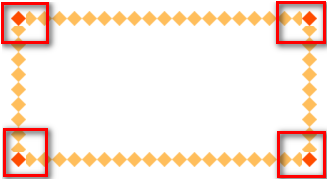

### 7.CSS 3盒子

#### 指定盒子类型(box-sizing)

- CSS3中可以通过box-sizing 来指定盒模型，即可指定为content-box、border-box，这样我们计算盒子大小的方式就发生了改变。
- 可以分成两种情况：
  - 1、**box-sizing: border-box**,**总体宽高限定**
  - 2、**box-sizing: content-box**,**只是内容部分限定,总体大小不确定**

### 8.CSS 3背景

#### background-size 设置背景图片的尺寸

属性值有:

- **cover**会自动调整缩放比例，背景大小 >  元素大小，如有溢出部分则会被隐藏。
- **contain**会自动调整缩放比例，元素大小  >  背景大小  。
- 也可以使用**长度单位或百分比** 

```html
<!--
contain: 背景图片 小于等于 元素
  cover: 背景图片 大于等于 元素
-->

<!--
background-size: cover;
background-size: 520px 320px;
/*width, height*/
-->

/*一步到位，和元素宽高一致*/
background-size: 100% 100%;
```

#### background-origin 设置背景定位的原点

属性值有:

- border-box以**边框**做为参考原点。
- padding-box以**内边距**做为参考原点。
- content-box以**内容区**做为参考点。

#### background-clip  设置背景区域裁切

属性值有:

- border-box裁切边框以内为背景区域。
- padding-box裁切内边距以内为背景区域。
- content-box裁切内容区做为背景区域。 

#### 多背景设置  url引入背景图片,使用","隔开


效果如下：看似完整的一张图片，其实事由四部分背景图片拼凑而成。

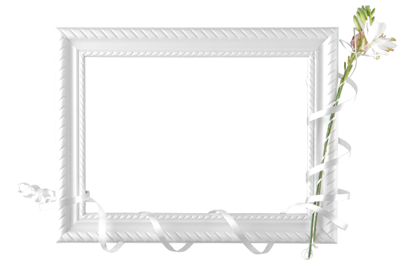

#### backface-visibility: hidden; /*不显示背景的背面*/

### 9.CSS 3渐变

- CSS 渐变 是在 CSS3 Image Module 中新增加的类型. 使用 CSS 渐变可以在两种颜色间制造出平滑的渐变效果. 用它代替图片，可以加快页面的载入时间、减小带宽占用。同时，因为渐变是由浏览器直接生成的，它在页面缩放时的效果比图片更好，因此你可以更加灵活、便捷的调整页面布局。 

#### 线性渐变(linear-gradient)

- 为了创建一个线性渐变，你需要设置一个起始点和一个方向（指定为一个角度）的渐变效果。你还要定义终止色。终止色就是你想让Gecko去平滑的过渡，并且你必须指定至少两种，当然也会可以指定更多的颜色去创建更复杂的渐变效果。
- `background: linear-gradient(to bottom , red, white);`
- 可以使用角度:
- `background: linear-gradient(60deg, red, yellow, pink,green,blue);`
- 也可以直接使用方向:(这里的%只是相对于100%的位置)
- `background: linear-gradient(to right, red 50%, yellow 70%, pink,green,blue);`
- 渐变的方向如下图：

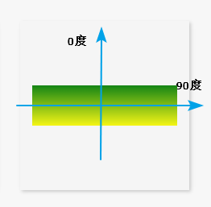


#### 径向渐变(radial-gradient)

- 径向渐变使用 radial-gradient 函数语法. 这个语法和线性渐变很类似, 除了你可以指定渐变结束时的形状 (可能时一个圆形或者一个椭圆形) 以及它的大小. 默认来说，结束形状是一个椭圆形并且和容器的大小比例保持一致。 
- **渐变只能代替背景图片!!!!!**
- **矩形的径向渐变**
- `background-image: radial-gradient(100px at center,yellow 50%  , blue, red);`
  `background-image: radial-gradient(100px at left top,yellow 50%  , blue, red);`
- **椭圆的径向渐变**
- `background-image: radial-gradient(ellipse at center, yellow, red, blue, pink,orange);`

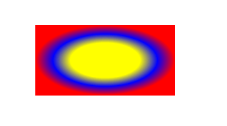

### 10.CSS 3过渡

- **过渡** 是CSS 3中具有颠覆性的特征之一，可以实现元素**不同状态间**的平滑过渡，经常用来制作动画效果。
  帧动画：通过一帧一帧的画面按照固定顺序和速度播放。


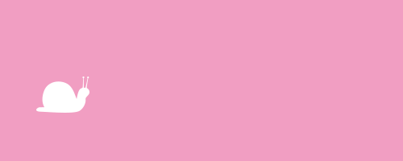

- 特点：当前元素只要有“属性”发生变化时，可以平滑的进行过渡。
- transition-property 设置过渡属性
- transition-duration 设置过渡时间
- transition-timing-function 设置过渡速度
- transition-delay 设置过渡延时 

```html
transition-property: border-color, background-color, color;
transition-duration: .5s;
transition-timing-function: ease-in;
transition-delay: .1s;

或者可以进行综合设置：
transition: border-color 0.5s ease-in 0.1s,
            background-color 0.5s ease-in 0.1s,
            color 0.5s ease-in 0.1s;
或者
transition:all 0.5s ease-in 0.1s;

<!--这里的all是为元素上所有的可设置样式设置过渡-->

/*使用综合设置方法 最后一个时间都是延迟时间*/
        /*
        transiton 需要在过渡的元素上提前设置好
        */
 transition: all 5s 0.1s linear;
<!--这里是指延迟 0.1 秒 持续时间为5秒-->
```

### 11.CSS 3 的2D转换

#### 位移(有单位px/%):transform: translate(X,Y);

- translate属于标准流,相对于自身的运动.

```html
<!--单个设置方法-->
transform: translateX(50px) translateY(50px);
<!--综合设置方法-->
形如:transform: translate(x,y);

transform: translate(50px,50px);
<!--此处的百分比是相对于自身-->
transform: translate(50%,50%);
```

#### 缩放(无单位):transform: scale(X,Y);

- scale属于标准流,相对于自身的运动.

```html
transform: scale(2,0.5);
<!--结果为宽度扩大2倍,高度变为原来的一半-->
```

#### 旋转(deg):transform: rotate(45deg);

- rotate属于标准流,相对于自身的运动.

```html
transform: rotate(45deg);
<!--结果为顺时针旋转 45 度-->
```

#### 扭曲/倾斜(deg):transform: skew(30deg, 30deg);

```html
transform: skew(30deg, 30deg);
<!--结果为 水平方向扭曲30度 垂直方向扭曲30度-->
```

### 12.CSS 3 的3D转换

- 3D 效果的实现**必须要有父元素** 而且需要给父元素设置(prespective)属性
- 给有3d效果的父元素设置perspective
- perspective是为了看到z轴的立体效果
- z> 0 元素有放大效果,它的属性值越小,放大效果越大.
- z< 0 元素有缩小效果
- transform-style: preserve-3d;让子元素位于三维空间内，便于查看立体效果

#### 位移(有单位px/%):transform: translateZ(100px);/transform: translate3d(X,Y,Z);

```html
<!--父元素 属性-->
perspective: 400px;

<!--让子元素位于三维空间内，便于查看立体效果-->
transform-style: preserve-3d;

<!--元素本身 方法一-->
transform: translate3d(0,0,100px);
<!--元素本身 方法二-->
transform: translateZ(100px);
```

#### 缩放(无单位):transform: scale3d(2, 2, 1);

```html
transform: scale3d(2, 2, 1);
```

#### 旋转(deg):transform: rotateX();/transform: rotateY();transform: rotateZ();

- 单位可以为turn; 	1turn = 360deg;

```html
<!--沿x轴旋转-->
	.x {
      width: 300px;
      height: 226px;
      background: url("./image2D/x.jpg");
      transition: all 2s;
    }

    .x:hover {
      transform: rotateX(180deg);
    }
<!--沿y轴旋转-->
    .y {
      width: 273px;
      height: 300px;
      background: url("./image2D/y.jpg");
      transition: all 2s;
    }

    .y:hover {
      transform: rotateY(180deg);
    }
<!--沿z轴旋转-->
    .z {
      width: 330px;
      height: 227px;
      background: url("./image2D/z.jpg");
      transition: all 2s;
    }

    .z:hover {
      transform: rotateZ(180deg);
    }
```

#### 设置转换原点:transform-origin

- **设置或检索对象以某个原点进行转换**

```html
<!--第一种 使用单词-->
transform-origin:left top;
<!--第二种 使用百分比 可以为负值-->
transform-origin:50% 50%;(默认50% 50%)
```

#### transform-style:preserve-3d;

- 指定某元素的子元素是（看起来）位于三维空间内，还是在该元素所在的平面内被扁平化。


### 13.CSS 3动画 

- **动画** 是同样是CSS3中具有颠覆性的特征之一，可通过设置**多个节点**来精确控制**一个或一组**动画，常用来实现复杂的动画效果。
- animotion是属于**标准流** 。


#### 创建动画的步骤

- 通过@keyframes指定动画序列
- 通过百分比将动画序列分割成多个节点
- 在各节点中分别定义各属性
- 通过animation将动画应用于相应元素

#### 常用动画属性

- animation-name 设置动画序列名称
- animation-duration 动画持续时间
- animation-delay 动画延时时间
- animation-timing-function 动画执行速度，linear、ease等
- animation-play-state 动画播放状态，running(播放)、paused(暂停)等
- animation-direction 动画逆播，normal(正常),reverse(反向),alternate(先正后反),alternate-reserve(先反后正)等
- animation-fill-mode 动画执行完毕后状态，forwards(结束时状态)、backwards(开始时状态)
- animation-iteration-count 动画执行次数，inifinate(无限)等

```html
<!DOCTYPE html>
<html>
  <head>
    <meta charset="utf-8">
    <title>animotion移动</title>
    <style media="screen">
      *{
        margin: 0;
        padding: 0;
      }
      
      /*将动画应用到某个元素*/
      .one{
        width: 200px;
        height: 200px;
        background: blue;
        position: relative;

        /*动画序列名称*/
        animation-name: myanim;
        /*动画执行速度*/
        animation-timing-function: ease-in-out;
        /*动画持续时间*/
        animation-duration: 5s;
        /*动画延时*/
        animation-delay: 0.5s
        /*播放状态*/
        animation-play-state: running;
        /*动画逆播*/
        animation-direction: alternate;
        /*播放次数 (无限循环)*/
        animation-iteration-count: infinite;

        /*综合设置方法,可设置多个，，每个总体拿逗号分开*/
        /*animation: myanim 5s ease-in-out infinite alternate;*/
        /*-webkit-animation:myanim myanim 5s ease-in-out infinite alternate;*/
      }
	  
      /*创建一个动画*/
      @keyframes myanim {
        0%{
          top: 0px;
          left: 0px;
          background: lightyellow;
        }
        25%{
          top: 0px;
          left: 200px;
          background: lightpink;
        }
        50%{
          top: 200px;
          left: 200px;
          background: lightblue;
        }
        75%{
          top: 200px;
          left: 0px;
          background: lightgreen;
        }
        100%{
          top: 0px;
          left: 0px;
          background: lightyellow;
        }
      }
    </style>
  </head>
  <body>
    <div class="one"></div>
  </body>
</html>
```

### 14.CSS 3伸缩布局

- 弹性布局（flexible box)模块旨在提供一个更加有效的方式来布置，对齐和分布在容器之间的各项内容，即使它们的大小是未知或者动态变化的。 
- 弹性布局的主要思想是让容器有能力来改变项目的宽度和高度，以填满可用空间（主要是为了容纳所有类型的显示设备和屏幕尺寸）的能力。 
- 最重要的是弹性盒子布局与方向无关，相对于常规的布局（块是垂直和内联水平为基础），很显然，这些工作以及网页设计缺乏灵活性，无法支持大型和复杂的应用程序（特别当它涉及到改变方向，缩放、拉伸和收缩等）。 

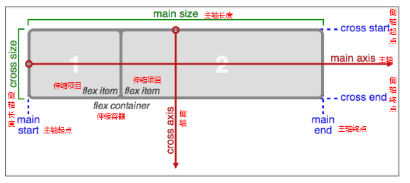

#### flex(伸缩盒子)常用属性

- **flex-grow 设置的flex子项的扩展比例**
- **flex-shrink 设置的flex子项的收缩比例** 
- flex-basis 设置的flex子项的基准宽度
- flex-flow 设置flex-direction 和flex-wrap
- **flex-direction 设置子元素排列的方向 (父元素)**
- **flex-wrap 设置子元素是否允许换行  (父元素)**
- **justify-content 主轴的对齐方式  （父元素）**
- **align-items 侧轴对齐  （父元素）**
- **align-content 设置的横向有换行的盒子的纵轴对齐  (父元素)**
- **align-self 子元素自身的纵轴对齐**  
- **order 设置子元素的排列顺序** 


#### flex-grow 设置的flex子项的扩展比例

- 默认值为0,用数值来定义扩展比率。**不允许负值**

#### flex-shrink 设置的flex子项的收缩比例

- 默认值为1,用数值来定义收缩比率。**不允许负值**

```html
<style>
  .f {
        width: 100%;
        height: 300px;
        box-sizing: border-box;
        border: 1px solid red;

        /*flex在父元素上设置，表示子元素都变成可伸缩的*/
        display: flex;
      }

      .f > .s {
        width: 200px;
        height: 200px;
        background-color: pink;
      }

      .f > .s:nth-child(1){
        /*不扩展*/
        flex-grow: 0;
        /*不收缩*/
        flex-shrink: 0;
      }
      .f > .s:nth-child(2){
        flex-grow: 2;
      }
      .f > .s:nth-child(3){
        flex-grow: 4;
      }
</style>
<div class="f">
      <div class="s">1</div>
      <div class="s">2</div>
      <div class="s">3</div>
</div>
```

#### flex-direction 设置子元素排列的方向 (在父元素设置)

- row：主轴与行内轴方向作为默认的书写模式。即横向从左到右排列（左对齐）。
- row-reverse：对齐方式与row相反。
- column：主轴与块轴方向作为默认的书写模式。即纵向从上往下排列（顶对齐）。
- column-reverse：对齐方式与column相反。

```html
<style>
  .f {
        width: 100%;
        height: 300px;
        box-sizing: border-box;
        border: 1px solid red;

        /*flex在父元素上设置，表示子元素都变成可伸缩的*/
        display: flex;
    	/*纵向排列,纵轴是主轴*/
    	flex-direction:column;
    	/*默认值为：row*/
      }
</style>
```

#### flex-wrap 设置子元素是否允许换行  (在父元素设置)

- nowrap：flex容器为单行。该情况下flex子项可能会溢出容器
- wrap：flex容器为多行。该情况下flex子项溢出的部分会被放置到新行，子项内部会发生断行
- wrap-reverse：反转 wrap 排列。

```html
<style>
  .f{
    /*换行/列名，纵向表示与flex-detiction:column;配合使用*/
      flex-wrap:wrap;
  }
</style>
```

#### justify-content 设置主(横)轴的对齐方式  （在父元素设置）

- flex-start
- flex-end
- center
- space-between
- space-around

```html
<style>
  .f {
    /*
       center,space-between等
    */
    /*纵向情况与flex-detiction:column;配合使用*/
    justify-content:space-around;
  }
</style>
```

#### align-items 设置侧(纵)轴对齐(不换行有效)  （在父元素设置）

- flex-start
- flex-end
- center
- baseline
- stretch (默认值)当子元素没有设置高度之后，设置会使子元素与父元素高度一致

```html
<style>
  .f {
    /*
       flex-start,stretch,flex-end,center,baseline等
    */
    align-items:center;
  }
</style>
```

#### align-content 设置的横向(有换行的)盒子的纵轴对齐  (在父元素设置)

- flex-start
- flex-end
- center
- space-between
- space-around
- stretch(默认值)

```html
<style>
  .f {
    
   	   display: flex;
    /*纵向排列*/
       flex-direction: column;
    /*换行*/
       flex-wrap: wrap;

       /*
       align-conent（设置的是侧轴）适用于多行或者多列，不换行是没有效果的
       */
       align-content: space-between;
  }
</style>
```

#### align-self 子元素 自身的纵轴对齐

- flex-start
- flex-end
- center
- baseline
- stretch (默认值)

```html
<style>
  .f1_s:nth-child(3){
        /*
        单独调节自身在侧轴的对齐方式
        */
        align-self: flex-start;

        /*
        值越小越靠前
        */
        order: -2;
      }
</style>
```

#### order 设置子元素的排列顺序

- 默认值为0,用整数值来定义排列顺序，数值小的排在前面。**可以为负值。**

```html
<style>
  .f1_s:nth-child(4){
        order: -1;
      }
</style>
```

### 15.媒体查询

- 媒体查询可以让我们根据设备显示器的特性（如视口宽度、屏幕比例、设备方向：横向或纵向）为其设定CSS样式，**媒体查询由媒体类型和一个或多个检测媒体特性的条件表达式组成。**
- 媒体查询中可用于检测的媒体特性有width 、 height 和 color （等）。使用媒体查询，可以在不改变页面内容的情况下，为特定的一些输出设备定制显示效果。

#### 常见媒体查询特性

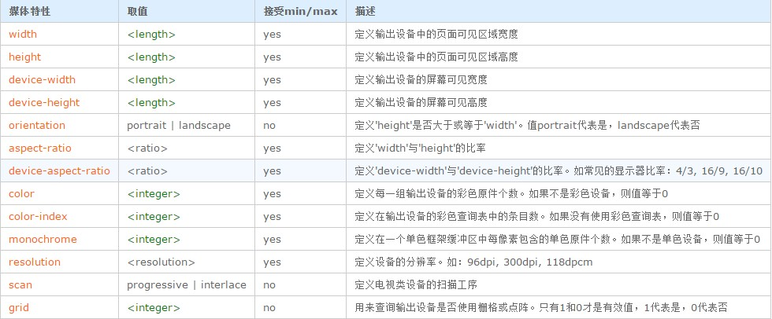

- 媒体查询的大部分媒体特性都接受min和max用于表达“大于或等于”和“小与或等于”。如：width会有min-width和max-width

#### 媒体查询应用(meta)

- 需要在html文档中添加以下代码，用来兼容移动设备的显示效果

```html
<meta name="viewport" content="width=device-width,initial-scale=1,maximum-scale=1,mininum-scale=1,user-scalable=no" />
<!--
参数解释：
	width=device-width:宽度等于当前设备的宽度
	initial-scale=1：初始的缩放比例（默认为1）
	maximum-scale=1：允许用户缩放到得最大比例（默认为1）
	user-scalable=no：用户不能手动缩放
-->
```

#### 媒体查询样式

```html
<!-- 检测宽度在500到1000之间的范围有效 -->
@media all and (min-width:500px) and (max-width:1000px){
    body{
        color:lightblue;
    }
    div {
        color: red;
    }
}

<!-- 屏幕上限超过300px 无效，小于300px body的字体颜色为黄色 
     根据当前屏幕的特点，当符合其中某个规则时，就会应用对应的样式
     根据可视窗口 宽度
-->
@media screen and (max-width:300px) {
    body {
        color: yellow;
    }
}

<!-- 检测高度在300到500之间的范围有效 -->
@media all and (min-height:300px) and (max-height:500px){
    body{color:lightblue;}
}

<!-- 
	检测屏幕 
	高度大于宽度时有效
-->
@media screen and (orientation: portrait){
    .test::after {
        content: "竖屏";
        color: red;
    }
}

<!-- 检测屏幕 宽度大于高度时有效 -->
@media screen and (orientation: landscape){
    .test::after {
        content: "横屏";
        color: red;
    }
}
```


