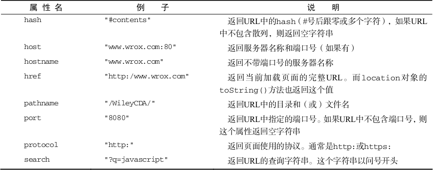
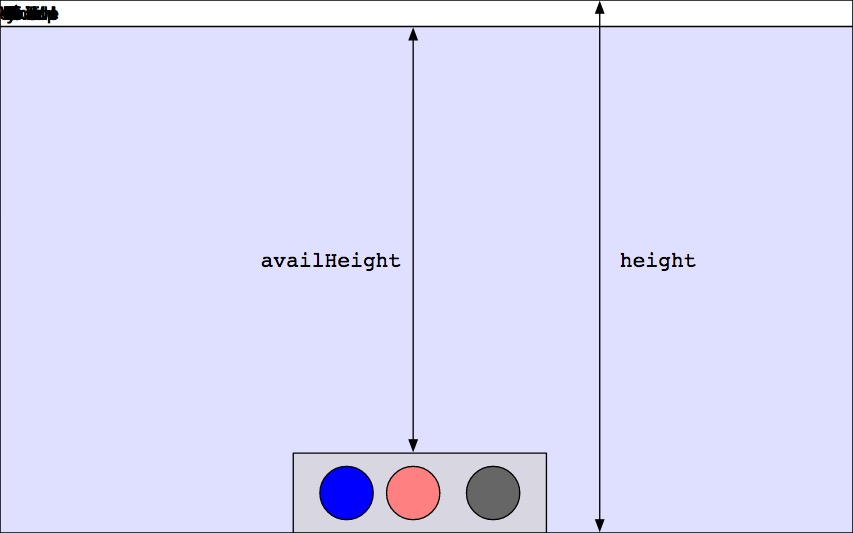

## BOM对象/浏览器对象/window对象方法及属性

[TOC]

## 浏览器对象模型

```html
<!DOCTYPE html>
<html lang="en">
<head>
	<script type="text/javascript">
		// onload
		console.log("苞米地里的小马");
		var box = document.getElementById('box');    
        /*
		 * 返回 null body还没有被解析, 所有DOM操作都会出错
         */
		console.log(box);  // null
	</script>
</head>
<body>
	<div id="box"></div>
</body>
</html>
<!--
	输出:
	苞米地里的小马
	null
-->
```

### window.onload 方法

- 所有 DOM 元素(包括图片加载完成),会回调这个方法,(异步方法)

```javascript
window.onload = function() {
    console.log("onload开始执行...");

    var box = document.getElementById('box');
    console.log(box);   // <div id="box"></div>

    // 可直接获取到图片的大小(图片已经加载完成)
    var HTL = document.querySelector("img");
    console.log("小灰灰身高:" + HTL.height + "px");  
  	// 小灰灰身高:101px

    console.log("onload加载完成!");
};
```

### img.onload

```javascript
var img = new Image();
img.src = "./img2/1.jpg";
console.log("马上获取高度:",img.height + "px");

img.onload = function() {
    console.log("图片开始 onload..");
    console.log("图片高度为:",img.height + "px");  
  	// 图片高度为: 1200px
    console.log("图片结束 onload..");
}
```

### window.addEventListener

```javascript
// DOM内容被加载完
window.addEventListener("DOMContentLoaded",function() {
    console.log("DOMContentLoaded");
    var HTL = document.querySelector("img");
    console.log(HTL);
    console.log("小灰灰身高:" + HTL.height + "px");  // 0
    console.log("--------DOMContentLoaded----------");
});
```

### 小结

- 先执行 DOMContentLoaded 能获取 DOM 元素,但是图片没加载完成( 问题: IE 6,7,8下不支持)
- 代码顺序执行, onload 有加载顺序
- 1.DOMContentLoaded
- 2.图片的 onload
- 3.window 的 onload

## window 对象方法

### window.open 打开新窗口

```javascript
// 可传三个参数:
window.open(["URL"],参数2,参数3);
// 参数1:
// 参数2:_self 代表当前窗口,默认是 _blank
// 参数3:width,height,left,top

win = window.open("./03-图片的懒加载.html","_blank","width=500,height=500,left=0,top=0");
console.log(win);
```

### window.close 关闭新窗口

```javascript
win && win.close();
// 谁关闭,就是谁调用
```

### window.moveTo/window.moveBy  移动新窗口

```javascript
// moveTo 是移动到某个位置 加到点击事件中不可重复移动
win && win.moveTo(1000,1000);
// moveBy 是移动某段距离 加到点击事件中可重复移动
win && win.moveBy(10, 10);
```

### window.scrollTo/window.scrollBy 滚动新窗口

```javascript
window.scrollTo(0,1000);
window.scrollBy(0,1);
```

### setInterval/clearInterval 间隔定时器

### setTimeout/clearTimeout  超时定时器

- [笔记链接](https://github.com/franksunhd/Note/blob/master/JavaScript-03.md)

### window.confirm 显示一段带有文本提示,取消按钮,确认按钮的提示框

```javascript
var rel = window.confirm("请问:你有男朋友吗?");
console.log(rel);  // 点确定返回 true 点取消返回 false

if (rel) {
    alert("尴尬 !V_V!");
} else {
    alert("高兴 ^_^");
}

// alert也是 window 的方法
```

### window.prompt(参数1,参数2) 带有文本提示和输入框的提示框

```javascript
var value = window.prompt("文本提示","默认输入");
 // 返回值是输入框的值
console.log(value);  // 
```

## window 常用属性 (Browser 对象)

### navigator 获取浏览器的信息

```javascript
// 获取浏览器信息
console.log(navigator);
// 返回由客户机发送服务器的user-agent 头部的值
console.log(navigator.userAgent);
// 返回浏览器的代码名
console.log(navigator.appCodeName);
// 返回浏览器的名称
console.log(navigator.appName);
// 返回浏览器的平台和版本信息
console.log(navigator.appVersion);
// 返回运行浏览器的操作系统平台
console.log(navigator.platform);
```

```javascript
function myBrowser() {
    var userAgent = navigator.userAgent; //取得浏览器的userAgent字符串
    var isOpera = userAgent.indexOf("Opera") > -1;
    if(isOpera) {
        return "Opera"
    }; //判断是否Opera浏览器
    if(userAgent.indexOf("Firefox") > -1) {
        return "FF";
    } //判断是否Firefox浏览器
    if(userAgent.indexOf("Chrome") > -1) {
        return "Chrome";
    }
    if(userAgent.indexOf("Safari") > -1) {
        return "Safari";
    } //判断是否Safari浏览器
    if(userAgent.indexOf("compatible") > -1 && userAgent.indexOf("MSIE")> -1 && !isOpera) {
        return "IE";
    }; //判断是否IE浏览器
}

//以下是调用上面的函数
var mb = myBrowser();
if("IE" == mb) {
    alert("我是 IE");
}
if("FF" == mb) {
    alert("我是 Firefox");
}
if("Chrome" == mb) {
    alert("我是 Chrome");
}
if("Opera" == mb) {
    alert("我是 Opera");
}
if("Safari" == mb) {
    alert("我是 Safari");
}
```

### location  网址信息



- Location.assign( ) 加载给定URL的内容资源到这个Location对象所关联的对象上。
- Location.reload( ) 重新加载来自当前 URL的资源。他有一个特殊的可选参数，类型为 Boolean，该参数为true时会导致该方法引发的刷新一定会从服务器上加载数据。如果是 false或没有制定这个参数，浏览器可能从缓存当中加载页面。
- Location.replace( ) 用给定的URL替换掉当前的资源。与 assign() 方法不同的是用 replace()替换的新页面不会被保存在会话的历史 History中，这意味着用户将不能用后退按钮转到该页面。 

```javascript
console.log(location);  // 打印的是location 对象
// 获取网址参数:网址?后面的内容
console.log(location.search);
// 端口:8020
console.log(location.port);
// 协议:http
console.log(location.protocol);
// 哈希: hash  (网址#abc) 可以作为参数进行传递
console.log(location.hash);
// href:网页的完整地址
console.log(location.href);


location.href = "07-open.html?name=lisi&age=18#pink";
          
// 页面刷新
location.reload();

// assign 载入新的文档 具有历史记录,可以回退到原来
location.assign("07-open.html?name=lisi&age=18#pink");

// replace 新的文档替换当前文档  没有历史记录,不能回退
location.replace("07-open.html?name=lisi&age=18#pink");
```

### history 浏览器历史记录

- history 对象保存着用户上网的历史记录,从窗口被打开的那一刻算起。因为 history 是 window对象的属性,因此每个浏览器窗口、每个标签页乃至每个框架,都有自己的 history 对象与特定的window 对象关联。

#### history.length 历史记录的长度

#### history.forward() 前进

#### history.back()  后退

#### history.go() 跳转到指定的 URL

- 正数代表前进,负数代表后退,范围超了无效

```javascript
// 获取历史记录
console.log(history);
console.log(history.length);
// 加载记录中的下一个URL
history.forward();	
// 加载记录中的上一个URL
history.back();
// 从历史记录列表中跳转到指定的URL
window.history.go(-2)
// 刷新当前页面
history.go(0);  // 正数代表前进,负数代表后退,范围超了无效
```

#### 无刷新替换浏览器地址

##### replaceState

```javascript
/*
 *  参数1:保存到 history 中的 state 属性中.
 *  参数2:新网址的标题,浏览器暂时不支持可以用 null
 *  参数3:网址新地址
 */
history.replaceState({age:18},"页面标题","./01-history.html");				
history.replaceState({age:19},"页面标题","./02-history.html");				
console.log(history);
console.log(history.state);
```

##### pushState

```javascript
/*
 * 与 replaceState 类似,浏览器地址都是显示最后一个
 * 区别: replaceState 不能有历史记录,但是 pushState 有历史记录
 * 
 * 每次调用一次 push, 就向 history 这个容器中压入一个历史记录,和数据结构的栈的概念一样,
 * 最后压入的在最顶部,(先进后出)
 * 
 * 特点:状态变化,
 */
 history.pushState({
    age:19,
    name:"lisi1"
 },null,"./01-history.html");

history.pushState({
    age:20,
    name:"lisi2"
},null,"./02-history.html");

console.log(history);
```

##### popstate 监听历史记录

```javascript
// 监听历史记录 , pushState 执行之后点击浏览器上的前进后退按钮才会执行 
window.addEventListener("popstate",function () {
    // 处理代码逻辑,比如发送 Ajax
    console.log(history);
    console.log(history.state);
    console.log(location);
});
```

### screen 屏幕信息



```javascript
/*
  获取屏幕分辨率的宽高;(和设备有关)
  window.screen.width  1920
  window.screen.height 1080
*/
console.log("屏幕分辨率的宽度:",window.screen.width,"高度:",window.screen.height);

/*
  屏幕可用工作区的宽高: 不包含任务栏等
  window.screen.availWidth
  window.screen.availHeight
*/
console.log("屏幕可用工作区的宽度:",window.screen.availWidth,"高度:",window.screen.availHeight);
```