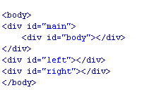

## 二栏/三栏布局，左右宽度固定，中间宽度自适应

[TOC]

### 1.前言

在如今各个分辨率显示器N足鼎立的时期，页面采用流动性布局（亦可称自适应布局）不失为一个好选择。当然，具体实现不是那么容易，需要一定的css功力和实践经验。本文不讲细节，只讲外部的自适应架构，这也是实现整个页面自适应的前提。目前为止，我所熟知的左中右三栏宽度自适应于浏览器的方法有三个：[绝对定位法](http://www.zhangxinxu.com/wordpress/2009/11/%E6%88%91%E7%86%9F%E7%9F%A5%E7%9A%84%E4%B8%89%E7%A7%8D%E4%B8%89%E6%A0%8F%E7%BD%91%E9%A1%B5%E5%AE%BD%E5%BA%A6%E8%87%AA%E9%80%82%E5%BA%94%E5%B8%83%E5%B1%80%E6%96%B9%E6%B3%95/#m1)，[margin负值法](http://www.zhangxinxu.com/wordpress/2009/11/%E6%88%91%E7%86%9F%E7%9F%A5%E7%9A%84%E4%B8%89%E7%A7%8D%E4%B8%89%E6%A0%8F%E7%BD%91%E9%A1%B5%E5%AE%BD%E5%BA%A6%E8%87%AA%E9%80%82%E5%BA%94%E5%B8%83%E5%B1%80%E6%96%B9%E6%B3%95/#m2)以及[自身浮动法](http://www.zhangxinxu.com/wordpress/2009/11/%E6%88%91%E7%86%9F%E7%9F%A5%E7%9A%84%E4%B8%89%E7%A7%8D%E4%B8%89%E6%A0%8F%E7%BD%91%E9%A1%B5%E5%AE%BD%E5%BA%A6%E8%87%AA%E9%80%82%E5%BA%94%E5%B8%83%E5%B1%80%E6%96%B9%E6%B3%95/#m3)。这些方法简洁实用，且无兼容性问题。如果您想在您的页面上使用流动性布局，相信本文给您一些启示的。

### 2.两栏布局的三种方法

#### 1.浮动

```html
<style>
.content-01{
  width: 100%;
  font-size: 30px;
  position: relative;
}

.content-01 .left {
  width: 200px;
  height: 200px;
  float: left;	/*左浮动 脱离标准流*/
  background: pink;
}

.content-01 .right {
  height: 200px;
  margin-left: 200px;
  background: purple;
}
</style>
<h1>第一种方法：浮动</h1>
    <div class="content-01">
      <div class="left">left</div>
      <div class="right">right</div>
    </div>
```

#### 2.绝对定位

```html
<style>
  .content-02 {
    position: relative;
  }
  .content-02 .left {
  width: 200px;
  height: 200px;
  background: red;
}

.content-02 .right {
  background: yellow;
  position: absolute;
  top: 0px;
  left: 200px;
  right: 0px;
  bottom: 0px;
}
</style>
<h1>第二种方法：绝对定位</h1>
    <div class="content-02">
      <div class="left">left</div>
      <div class="right">right</div>
    </div>
```

#### 3.伸缩布局

```html
<style>
  .content-03 {
  display: flex;
}

.content-03 .left,
.content-03 .right {
  width: 200px;
  height: 200px;
}

.content-03 .left {
  flex-grow: 0;
  flex-shrink: 0;
  background: red;
}

.content-03 .right {
  background: green;
  flex-grow: 1;
  flex-shrink: 1;
}
</style>
<h1>第三种方法：伸缩布局</h1>
    <div class="content-03">
      <div class="left">left</div>
      <div class="right">right</div>
  </body>
```

### 3.三栏布局的四种方法

为了演示的需要，首先限定下示例的布局结构：左中右三栏布局，左右两栏宽度固定（要想不固定将宽度值改为百分值即可），中间栏宽度自适应。左右两栏的宽度为200像素。

#### 1、绝对定位法

这或许是三种方法里最直观，最容易理解的：**左右两栏采用绝对定位**，分别固定于页面的左右两侧，中间的主体栏用左右margin值撑开距离。于是实现了三栏自适应布局。

您可以狠狠地点击这里：[绝对定位法演示demo](http://www.zhangxinxu.com/study/200911/three-column-width-auto-1.html)

css代码如下（为截图）：


HTML代码为（图片）：


这里的左中右三个div的顺序是可以任意调整的，这与剩下的方法就不一样了，需要注意一下。

此方法的优点是，理解容易，上手简单，受内部元素影响而破坏布局的概率低，就是比较经得起折腾。
缺点在于：如果中间栏含有最小宽度限制，或是含有宽度的内部元素，当浏览器宽度小到一定程度，会发生层重叠的情况。然而，一般情况下，除非用户显示器分辨率宽度>=1600像素，否则用户不会把浏览器缩小到1000像素以下的，所以该缺陷危害指数3.

#### 2、margin负值法

这种方法是在实际的网站中应用的最多的，我个人感觉多少有些跟风的嫌疑。此方法很难用一句话概括。首先，**中间的主体要使用双层标签**。外层div宽度100%显示，并且浮动（本例左浮动，下面所述依次为基础），内层div为真正的主体内容，含有左右210像素的margin值。左栏与右栏都是采用margin负值定位的，左栏左浮动，margin-left为-100%，由于前面的div宽度100%与浏览器，所以这里的-100%margin值正好使左栏div定位到了页面的左侧；右侧栏也是左浮动，其margin-left也是负值，大小为其本身的宽度即200像素。

见下面的css代码：


HTML代码：


您可以狠狠地点击这里：[margin负值法演示demo](http://www.zhangxinxu.com/study/200911/three-column-width-auto-2.html)

您需要注意几个div的顺序，无论是左浮动还是右浮动，先是主体部分div，这是肯定的，至于左右两栏谁先谁后，都无所谓，我测试了IE6，Firefox，以及chrome浏览器，表现一致。

此方法的优点：三栏相互关联，可谓真正意义上的自适应，有一定的抗性——布局不易受内部影响。
缺点在于：相对比较难理解些，上手不容易，代码相对复杂。出现百分比宽度，过多的负值定位，如果出现布局的bug，排查不易。

#### 3、自身浮动法

此方法代码最简单。应用了标签浮动跟随的特性。左栏左浮动，右栏右浮动，主体直接放后面，就实现了自适应。

您可以狠狠地点击这里：[自身浮动法演示demo](http://www.zhangxinxu.com/study/200911/three-column-width-auto-3.html)

css代码如下：


HTML代码：


这里三个div标签的顺序的关键是要把主体div放在最后，左右两栏div顺序任意。

此方法的优点是：代码足够简洁与高效
不足在于：中间主体存在克星，clear:both属性。如果要使用此方法，需避免明显的clear样式。

#### 4、伸缩布局法

```html
.main-04 {
  display: flex;
}

.main-04 .left,
.main-04 .right {
  width: 200px;
  height: 200px;
  flex-grow: 0;
  flex-shrink: 0;
  background: pink;
}

.main-04 .center {
  height: 200px;
  flex-grow: 1;
  flex-shrink: 1;
  background: red;
}
```

### 4.下载

您可以狠狠地单击这里：[demo打包下载](http://www.zhangxinxu.com/study/down/three_column_width_auto.zip)（zip ）

### 5.结语

table表格可谓是自适应布局的利器，如今Google的产品页面，yahoo等自适应页面都还是使用的table技术，原因在于table本身的自适应能力。然而，虽然它是Google，它是yahoo，但是我依然很鄙视，您可以试试用firebug去看一下Google页面的HTML代码，unbelievable！层级多的惊人，代码真是多，臃肿！我过去觉得可能是某些功能之需，现在发现是追求技术，可扩展，自适应的副产物。我多次实践，可以非常肯定的说：div完全可以取代table实现自适应布局。

本文提供的仅仅是我个人知道的几种自适应方法，其实，我相信，肯定还有其他的方法，这就需要你我对其关注思考并发现了。